# Telemetry and Analytics for ASCE Data Tool Usage

## Table of Contents

- [Executive Summary](#executive-summary)
- [Conceptual Overview](#conceptual-overview)
  - [Problem Statement](#problem-statement)
  - [ACE Data Tool Overview](#ace-data-tool-overview)
  - [ACE Telemetry Server Overview](#ace-telemetry-server-overview)
- [Architecture](#architecture)
  - [Database](#database)
  - [API](#api)
  - [Web App](#web-app)
  - [Middleware, Utilities, and Control Flow](#middleware-utilities-and-control-flow)
- [Features](#features)
  - [ACE Data Tool Integration](#ace-data-tool-integration)
  - [Bottle View](#bottle-view)
  - [Leaderboard](#leaderboard)
  - [Full-Text Search](#full-text-search)
  - [Schema Versioning and Updates](#schema-versioning-and-updates)
- [Development and Packaging](#development-and-packaging)
  - [Test Data Generation and Coverage](#test-data-generation-and-coverage)
  - [Continuous Integration](#continuous-integration)
    - [Containerization](#containerization)
- [Technologies/Terms of Reference](#technologiesterms-of-reference)
  - [Containers](#containers)
  - [Go Programming Language](#go-programming-language)
  - [Data Hashes and Digests](#data-hashes-and-digests)
  - [Relational Databases and Structured Query Language](#relational-databases-and-structured-query-language)
- [Acronyms](#acronyms)

## Executive Summary

The Air Force Research Laboratory's (AFRL) Autonomous Capabilities Team
3 (ACT3) has developed a prototype server for collection and sharing of
metadata about datasets of interest to autonomy researchers. The project
is part of ACT3's Air/Space Force Cognitive Engine (ACE) and is known to
the team and users as the ACE Telemetry Server.

The ACE Telemetry Server is designed to interoperate with the ACE Data
Tool on an opt-in basis. Users of the ACE Data Tool can configure the
tool to send data about their data bottle usage to the telemetry server
to help other researchers discover data of potential interest. In turn,
researchers can access the web user interface of the server to search
for data by description.

The server also features "leaderboard" functionality, which allows
researchers to see a rank-ordered list of bottles with a particular
metric. This is useful for data bottles which contain machine learning
models tuned for a certain task. By assigning a metric to the bottles,
such as "accuracy," it is possible for a team of researchers to easily
see which model currently performs best for the task, inspect it, and
try to improve upon the work.

This document gives a brief overview of the design decisions, code
features, database technologies, and includes build, packaging, and
deployment techniques employed by the team during creation of the
server. It serves as a guide to familiarize interested parties with the
project as well as a historical reference for future work.

The bulk of the work for this deliverable is contained in the form of
code within the code repository itself as well as in the many design
meetings which occurred to converge upon the most important features and
user experience for researchers.

The basic usage flow of the ACE Data Tool in conjunction with the ACE
Telemetry Server is shown in the following diagram:

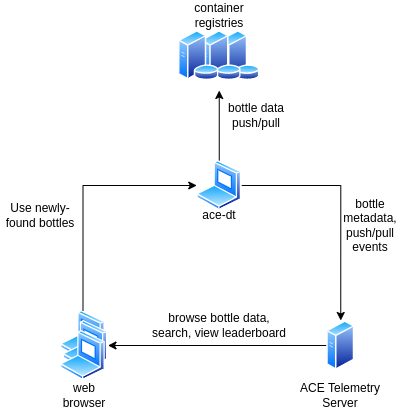

## Conceptual Overview

### Problem Statement

Autonomy researchers and data scientists rely on increasingly large sets
of data. They must be able to download other researchers' datasets *and*
share their own with minimal hassle. As the difficulty of sharing data
increases, the likelihood of the data being shared decreases.

The typical response to this problem is to create "one large, shared
space" for every researcher to use. Stringent access controls, such as
groups and two-factor authentication are employed, which inhibit
beneficial automated systems from accessing the data. Storage quotas are
enabled, which inhibit researchers from freely storing the huge amounts
of data involved in service- or agency-level research.

The "one large, shared space" solution is further marred by a lack of
access to the administrators of the system. When the number of users
grows past a certain point, the support system inevitably becomes more
ticket-based versus conversation-based, discouraging researchers from
raising issues of usability. This results in researchers using the
system only because they are required to, and they are often slowed by
onerous authentication and support procedures. They seek workarounds for
security systems, such as manually copying access tokens or writing
scripts to automate login processes. Eventually many users may give up
on the "one large, shared space" altogether and form their own "small,
fragmented space" with their own rules.

This is clearly not an ideal situation for any organization like ACT3
that is serious about empowering researchers and sharing data with
minimal bureaucracy.

### ACE Data Tool Overview

One possible solution to this problem of sharing large amounts of data
is to focus on the *dataset* as the unit of storage, rather than the
storage system itself. The idea is to designate a folder, with an
arbitrary set of files and some metadata, as a discrete, portable
dataset. This folder can be any arbitrary size, and parts of the
datasets may even be omitted or stored elsewhere in the case of
exceptionally large datasets.

The AFRL ACT3 developed this concept. The ACE Data Tool serves autonomy
researchers and data scientists by acting as a client-side tool for
controlling and managing large amounts of data. The ACE Data Tool refers
to each unit of data as a "data bottle," which contains an arbitrary
file structure with a standard metadata format for information such as
authors, description, and labels.

The data bottle concept differs from "traditional" big data storage
approaches because bottles are not tied to one specific location as
described above. Instead, data bottles include metadata details which
conform to the Open Container Initiative (OCI) specification for
container image distribution. Data bottles effectively act as container
images which are not executable, but instead include data to be used by
some other executable, whether containerized or native. Data bottles are
commonly used by researchers in conjunction with popular machine
learning frameworks such as TensorFlow and PyTorch.

As such, data bottles can be uploaded to any pre-existing container
registry. Due to the recent, explosive growth of containers in the tech
industry, there are many cloud providers and independent options for
storage of containers, and there is intense competition to provide
solutions for other concerns such as cost and security. Data bottles
passively benefit from any improvements made in the container industry,
specifically for storage in container registries, and they are not
dependent on one specific location or vendor for storage.

The following diagram shows the basic lifecycle of an ACE Data Bottle:

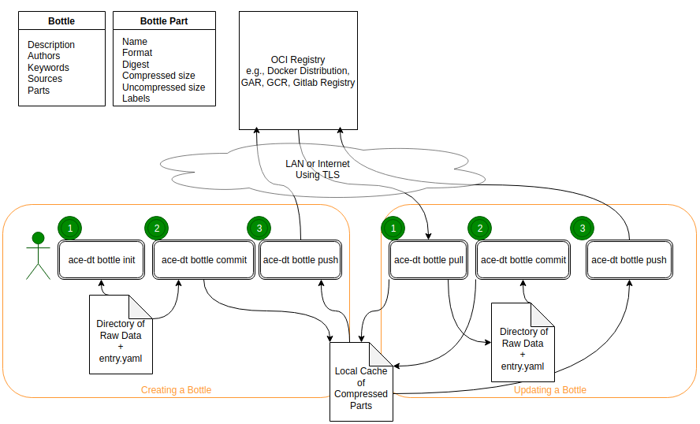

And the next diagram shows three ways to consume ACE Data Bottles: via
the command line with the ace-dt tool, within a Kubernetes pod on a
cluster which support ACE Data Bottles, and within the ACE Hub
application:

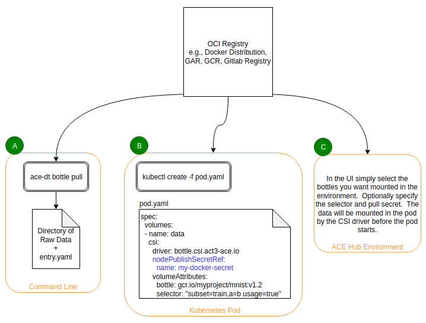

### ACE Telemetry Server Overview

The ACE Telemetry Server helps to solve the problems of *data
discoverability* and *data provenance*, and it is designed to operate
seamlessly with the ACE Data Tool. Users may opt-in to have ACE Data
Tool usage reported to the Telemetry Server, which keeps track of
various statistics including bottle name and other generic metadata,
lineage (i.e., which bottles were derived from which other bottles), and
arbitrary, user-defined metrics for each bottle.

The server does *not* store the bottles themselves; it only stores
information about them. Bottle storage is done directly between the ACE
Data Tool and an OCI registry, with details about the push/pull events
and other metadata sent to the ACE Telemetry Server as needed.

The server provides two primary interfaces for interaction: a RESTful
web application programmer interface (API), intended for use by
automated tooling such as the ACE Data Tool, and a web UI, intended to
assist users in understanding details about a particular bottle and
searching for other bottles of interest.

The server is written in the Go programming language and makes heavy use
of community-maintained, open-source packages. It utilizes the
PostgreSQL database for persistence via the Gorm ("Go Object-Relational
Mapper (ORM)") abstraction. The web API is built with the Gorilla Mux
library, and the server includes built-in instrumentation (performance
monitoring) via the Prometheus library. Several other packages are
included for control flow, configuration, logging, and other various
non-functional concerns.

The server can be run natively or be packaged into a container for use
in Docker or Kubernetes. A Dockerfile is included for building the
container, and Kubernetes manifest files are available in the form of a
Helm chart for use in cloud-native environments.

## Architecture

The ACE Telemetry Server code contains three packages, which are part of
a single Go language module: the **database** layer, the **API**, and
the **web application**. Each of these packages serves a major purpose
in the code, while other, smaller packages serve as glue and plumbing to
bring the major components together.

### Database

The ACE development team decided to utilize the PostgreSQL database via
the Gorm driver library for Go. The reasoning for this decision, as well
as the alternatives considered, are discussed in this section.
Additionally, the database schema types are described.

When deciding on a database to use, the team considered several factors
related to suitability, team experience, and licensing.

For suitability purposes, the database needs to provide reasonable
performance for the workload. While the ACE Telemetry Server is in its
infancy and currently processes limited volumes of information, but the
team needed to plan for greater usage. This ruled out databases which
would not operate in a scalable, cloud-native environment.

The database also needs to have the ability to provide basic full-text
search functionality. While a larger project would have a dedicated
backend search service separate from the database program, the rapid
prototyping nature of the project required the team to use the built-in
search functionality of the database they selected. Different databases
have different levels of sophistication in their search functionalities.

Team experience was also a major factor in database selection. The
database of choice must be reasonably easy for ACE team members to
understand and work with. Members should not need to spend inordinate
amounts of time reading tutorials and learning before being productive
with the selected database.

The ACE team also considered the available libraries for each database.
The Go programming language is newer than many other language choices
and does not yet have as robust a set of libraries, thus limiting
database selection. The team did not want to create and maintain a
customized database driver.

Finally, licensing was a major consideration in database selection.
Different databases have different levels of openness; some are "barely
open-source,\" with big commercial licenses available and a neglected
open-source community, while others are entirely open-source with large
teams of volunteers actively maintaining the software. The ACE team
tends to choose software that is more open, often with the tradeoff that
there are more bugs which do not get addressed as quickly and need
workarounds. This is generally acceptable when compared to the
alternative of the process of acquiring funding and paying license fees.

The top contenders for use were SQLite, MongoDB, Neo4j, and PostgreSQL.

DB Name|Scalability|Team Experience|License
-|-|-|-
SQLite|Single Machine|Moderate|Public Domain
MongoDB|Low|Minimal|Somewhat Open
Neo4j|Low (Community Edition)|None|Open (Community Edition)
PostgreSQL|High|Moderate|Open

SQLite is a file-based relational database. It is accessed and modified
with the well-established structured query language (SQL). It does not
run as a server on its own, but instead is driven by a library in a
program. The actual data is stored as a single file and read/write
speeds are limited only by what the operating system can handle in terms
of disk throughput and CPU power. From the programmer's perspective,
data are stored in tables with columns, and certain columns are
designated for identification and relational purposes. Generally, there
is one table per type of data, and a given entry in one table can use a
key to indicate that it is related to some different entry in another
table.

While SQLite is great for single-machine applications, it falls short
for the purposes of ACE Telemetry Server, where the database should be
decoupled from the application as a separate service. The ACE Telemetry
Server is designed to be a cloud-native application, where there may be
many instances of the server running in different places, all of which
must access the same database for consistency. SQLite does not work well
for this purpose.

MongoDB takes a different approach for storing data, in that it does not
have "tables" preferring instead to store data as "documents" without
the rigid structure imposed by relational databases. This offers greater
flexibility to application developers, but it also presents the
possibility of orphaned or otherwise unusable data, especially during
migrations. Because no schema is enforced, and documents may be
structured however the application developer likes, there is a tendency
for data to become increasingly disorganized over time. While this is
not a problem for projects early in their development, it slows
development significantly over time, especially for applications which
must store large amounts of data.

Additionally, the MongoDB licensing is becoming stricter. MongoDB
imposed a new "Server Side Public License" which significantly restricts
the ability to host MongoDB as a service, and there are legal gray areas
and questions about whether a service that utilizes MongoDB counts as
"MongoDB as a service" or not.

Neo4j is a graph database which utilizes the mathematical concepts of
"edges" and "vertices" to store and relate data. Instead of tables and
rows, as seen in a traditional relational database, graph databases
operate in terms of graphs and nodes. Each node is a certain type with
key-value pairs and relationships to other nodes of the same or
different types. Neo4j is accessed via its Cypher Query Language (CQL),
which is similar in concept to SQL but with a different syntax
specifically tailored for graph-based data access.

While Neo4j was a strong contender, the team ultimately decided to defer
use of Neo4j until later due to the learning curve and unfamiliarity
with graph databases, instead focusing on quick prototyping. While data
bottles have a natural graph-like structure, in terms of ancestor and
descendant bottles, the team opted to use simple tables instead, until
there is a compelling reason to switch to the more exotic graph
structure.

PostgreSQL, like SQLite, is a relational database. However, it runs as a
separate, dedicated service. It is released under its own PostgreSQL
License, which is like the Massachusetts Institute of Technology (MIT)
or Berkeley Software Distribution (BSD) licenses. The MIT and BSD
licenses are well-established throughout the open-source community, and
they allow free distribution and modification of the code, so long as
the copyright notice is maintained. This allows use with minimal
restrictions by individuals and businesses.

Because it is a dedicated service, has an open license, and is familiar
to the developers, the ACE team ultimately decided to utilize PostgreSQL
as the backing storage for the ACE Telemetry Server.

The team then decided to utilize the Gorm (Go Object-Relational Mapper
(ORM)) library for interfacing with PostgreSQL.

ORMs are designed as an abstraction layer between SQL and application
code. Instead of creating SQL statements in code, which is error-prone
and historically insecure, a developer can create objects in code which
are understood by the ORM and translated to SQL automatically. This
theoretically eliminates or drastically reduces the need for the
developer to know SQL.

During the database analysis, the team also considered utilizing a raw
SQL library in Go, but this would have resulted in significant,
unnecessary overhead in development. The result would have been like
Gorm's functionality, but not tested and maintained with the same rigor.

Additionally, Gorm provides the ability to utilize different database
drivers to support multiple database types. In practice, the team found
that a lot of custom SQL code, mixed with Gorm's lower-level functions,
is required to provide support for multiple databases. The process to
debug even a simple function can take hours due to the complexity of the
statements generated and doing this process for multiple databases does
not make good sense.

Gorm also enables automatic database migrations when developers update
the schema due to new requirements. This reduces the amount of
scaffolding and initialization code required to populate a blank
database or update one that has been used previously. Some code is still
required to bring old structures within the database up to date, but
Gorm handles the manipulation of the table structures themselves.

The team gradually evolved the primary data structures as the Data Tool
changed and users provided feedback. While the design continues to
evolve with new requirements and insights from continued use, the
primary data structures are:

- Blob
- Bottle
- Manifest
- Event

Blobs, or "binary large objects," can be any arbitrary data. The main
purpose for blobs in the ACE Telemetry Server is to store public
artifacts, small metadata files that do not belong in the bottle itself
but provide useful information about the bottle. This often includes
example Jupyter notebook files or diagrams that can help a potential
user understand more about the data contained within.

Blobs are referenced by their "digest," or hash value. The contents of
an arbitrary set of data, like the bytes of a file, are passed into a
cryptographic hash function to create a short, unique value for that
data. Then, if multiple data bottles happen to upload the same public
artifact, the subsequent upload attempts will hash the artifact and find
that it already exists in the blobs table. This prevents duplication of
public artifacts, which may be especially common in bottles which are
derived from others.

While the blob structure is currently intended for use with public
artifacts, it is flexible enough to be used for other generic storage
purposes in the future as needed.

The Telemetry Server can show arbitrary public artifact blobs from the
web application. For example, the following screenshot shows how the
Telemetry Server visualizes an image which has been stored as a public
artifact in the bottle, which in turn is represented as a blob in the
server's database.

The Bottle structure stores metadata about ACE data bottles. The
following information is included:

- Authors
- Sources
- Metrics
- Public Artifact references (stored in the blob table)
- Labels
- Annotations
- Part references (stored in an OCI registry)

The code for the Bottle structure is as follows:

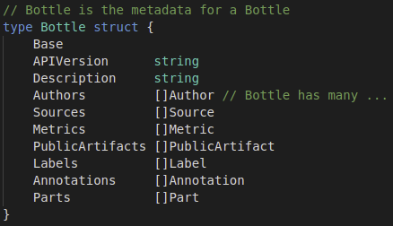

More information about the types from which Bottle is composed can be
found in the Git repository at pkg/db/models.go.

Author information includes name, an optional URL such as a homepage,
and email address. The fields related to Sources are name and URI for
the source. The URI can be a web page or a reference to another bottle
from which this bottle is derived.

Metrics are arbitrary name/value pairs, with optional description
fields, and are used for identifying the performance characteristics of
a particular bottle (such as "accuracy=0.91" or "epoch=7"). Metrics are
especially useful for rank-ordering bottles in a leaderboard to
determine which version of a particular model performs best on a given
problem. Metrics are *always* stored as floating-point values.

Public Artifact references point to entries in the blobs table, as
described above, which often contain example files or diagrams.

Labels and Annotations are used for additional metadata that does not
belong in Metrics. Labels store key/value pairs, where the value is
numerical (but stored as a string to avoid floating-point rounding
errors), and Annotations are any arbitrary key/value pair, numerical or
otherwise.

Parts are "subcompartments" of a bottle. Each part in a bottle has a
name, size, digest, and set of labels. Parts exist so that a user can
download only a piece of a bottle (in case the bottle is too large to
fit on one's machine or there is poor network connectivity).

The Manifest is an "instantiation" of a bottle on an OCI registry. A
bottle can have many Manifests; one for each registry on which it is
stored. The manifest stores information about layers of the image on the
registry; the layers may differ from registry to registry depending on
factors such as encryption, compression, and version differences. By
attaching the Manifest to each Event, the ACE Data Tool gives the
Telemetry Server an understanding of each location of a bottle.

The Manifest is defined in the code as follows:

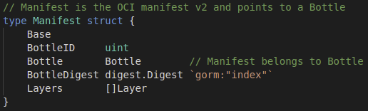

The Event structure stores information about actions taken on Bottles.
The main information captured in each Event includes:

- Manifest
- Bottle
- Action
- Repository and Tag
- Authentication (whether it is required)
- Bandwidth statistics
- Timestamp
- Username

The structure in the code is defined as follows:

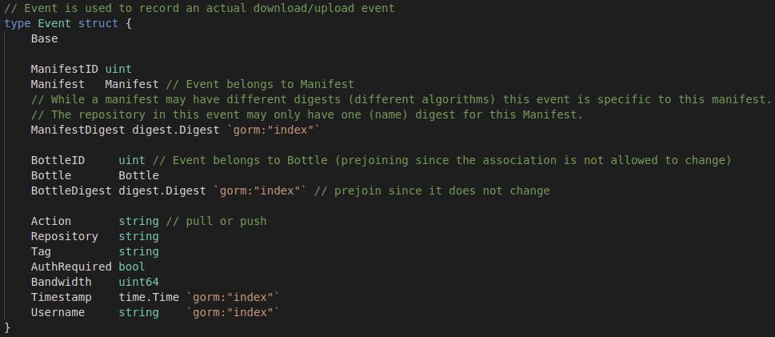

The Action is a "push" or "pull," depending on whether the bottle was
pushed or pulled. This is stored as a string, so that other action types
may be added in the future.

The Repository and Tag are the URI of the registry, along with the
version of the bottle. This is the common format of Docker containers,
e.g., "docker.io/nginx:1.0".

The Bandwidth statistic is a number indicating the average
download/upload speed encountered while performing the action. It is
useful for making recommendations (when implemented) to clients about
the best registry to use for a given bottle.

### API

The application programmer interface (API) is where entities like the
web app and any automated programs can access the public-facing
functionality of the Telemetry server. It provides a set of functions
which can be called via hypertext transfer protocol (HTTP) requests.

Each method within the API receives some input, does some processing,
and may optionally return some output. For instance, methods exist to
upload blobs to the server, followed by bottle metadata, followed by
event data. Some methods receive a bottle ID and return information
about the bottle. The following are examples of routes which are
understood by the API, and a fuller list along with example files for
request bodies can be found in the Git repository's file structure at
*testdata/test.http:*

- POST \<baseURL\>/api/blob?digest=\<digest\> HTTP/1.1\
    Content-Type: application/octet-stream\
    \
    \<blob bytes\>
- PUT \<baseURL\>/api/bottle HTTP/1.1\
    Content-Type: application/vnd.act3-ace.bottle.config.v1+json\
    \
    \<bottle JSON\>
- PUT \<baseURL\>/api/manifest HTTP/1.1\
    Content-Type: application/vnd.oci.image.manifest.v1+json\
    \
    \<manifest JSON\>
- PUT \<baseURL\>/api/event HTTP/1.1\
    Content-Type: application/json\
    \
    \<event JSON\>
- GET \<baseURL\>/api/bottle?digest=\<digest\>
- GET \<baseURL\>/api/metric?metric=learning\_rate&count=5&order=asc

Each request controls some functionality of the server. The API
continues to evolve rapidly from new requirements as usage increases, so
full documentation would quickly become outdated until a stable API is
achieved. However, the primary API methods involve pushing and querying
blobs, bottles, manifests, and events.

The API is implemented with the Gorilla Mux library, "a powerful HTTP
router and URL matcher for building Go web servers," which greatly
simplifies development and increases iteration speed
(<https://github.com/gorilla/mux>). Gorilla Mux provides the ability to
receive a request URL, match it with a route defined within the
application, and pull variable values from the request path for further
use in the route. The library is written to work well in a multithreaded
environment.

### Web App

The ACE team found that the ACE Telemetry Server requires a web
interface to be useful to end users searching for data bottles. The
typical way to do this in modern web development involves the creation
of a web API with a separate web interface service which is likely
written with a JavaScript library such as Angular, React, or Vue.

While the separate interface concept allows modularity for a large
application and separates the concerns between the logic and
presentation of information, it also presents some challenges which are
difficult to overcome for a small team. The biggest challenge is API
synchronization, especially for an API which changes quickly. When a web
application depends on a separate API, versioning becomes a priority to
ensure the application continues to work properly, and this hampers
development speed.

The ACE team decided to instead take a templating approach within the
server itself. The "html/template" library, which is built into the Go
language, provides functionality for utilizing the data structures of
the application directly instead of through a version-controlled API.

This allows for faster prototyping of the web application (the "pages"
that a user views in the browser) and enables developers to catch errors
instantly when there is a mismatch between the data structures used by
the API and the web application. If there is such a mismatch, the
application will not compile, and the continuous integration pipeline
will fail.

The web application templates themselves are in the "assets/templates"
folder of the code repository. Templates have variables available to
them based on the handler from which each one is called. The handler
receives the request, processes the logic, stores the results in
variables, and passes the variables along to the template, which is then
returned and sent back to the original requester (the client).

### Middleware, Utilities, and Control Flow

The ACE Telemetry Server includes various middleware and utilities to
aid in running and instrumenting the program and avoiding repeated code.

In HTTP pipelines, middleware functions by intercepting a request or
response and adding or modifying some piece of data. In the ACE
Telemetry Server, middleware exists for the purposes of tracing a
request through the request pipeline, logging, tracking metrics with
Prometheus, verifying signatures of uploaded artifacts, and working with
database connections. The middleware functions are defined in
"pkg/utils/middleware.go".

To handle argument parsing and runtime configuration, the ACE team
selected the Go Cobra and Viper libraries, respectively. Both libraries
are written to be cohesively used together, though their concerns are
separate.

Cobra enables robust command line argument parsing and automatically
generates usage screens, making command-line interface usage of the
server far simpler and easier to change. Cobra enables subcommands,
flags, and arguments to flags and is designed to follow the convention
"command action object \<flags\>," e.g., "server start api \--port
8080".

Arguments parsed from Cobra are put into an object which is usable by
Viper, which in turn provides configuration values to various parts of
the application which need them.

Viper is also able to read configuration values from a JavaScript Object
Notation (JSON)- or YAML Ain't Markup Language (YAML)-formatted file or
environment variables. This increases flexibility in development and
cloud-native environments, where configuration files and environment
variables may be more convenient for configuration than command-line
arguments. Viper can take values from a mix of sources and prioritize
them.

## Features

The ACE Telemetry Server includes several main features to make it
easier for researchers to discover data in which they may find interest.
Among these are integration with the ACE Data Tool via an opt-in
setting, ability to view the details of a given bottle briefly, ability
to see bottles ranked against one another in the form of a leaderboard
for a given metric, full-text search on descriptions of bottles, and
version awareness to enable new bottles schemas over time as new
requirements surface.

The welcome page (<https://telemetry.lion.act3-ace.ai>, which requires
an ACT3 VPN connection) includes introductory information about the
server:

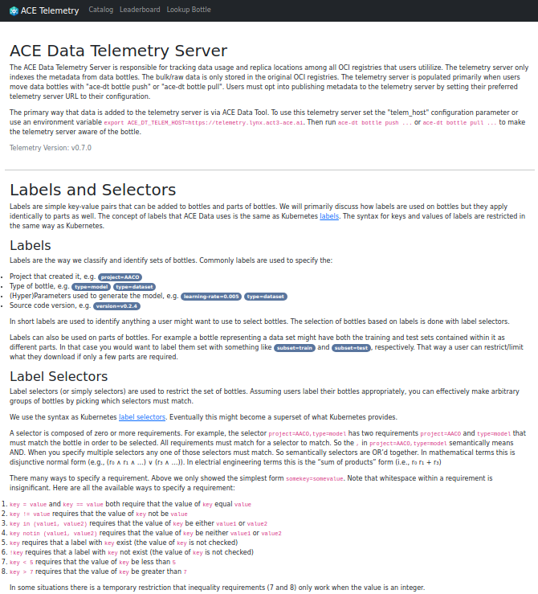

The starting area for bottle display shows an overview of some bottles,
each with the most pertinent information:

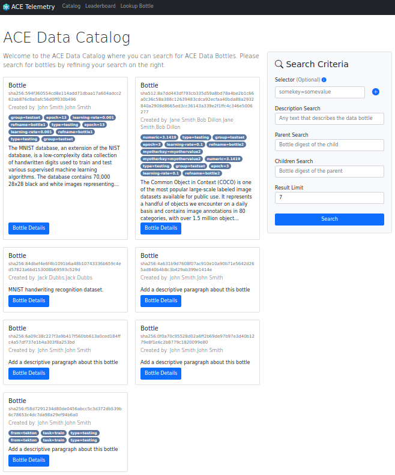

### ACE Data Tool Integration

Integration between the ACE Telemetry Server and the ACE Data Tool is
seamless. When a user adds a configuration entry for a telemetry
server's URL, the Data Tool automatically reports information about the
bottle and events which the client is performing.

Only the minimum amount of information necessary is sent to the
Telemetry Server. The Data Tool assumes that the Telemetry Server has
seen a given bottle when it pushes an event which references the bottle.
If the Telemetry Server has seen the bottle, it will accept the event,
but if not, it will request additional information from the Data Tool
about the bottle so that it has the record for future analysis and
tracking.

### Bottle View

For any bottle the Telemetry Server has knowledge of, e.g., from an
event posted by the Data Tool, an information page is available for
users to gain an understanding of the bottle. The page includes details
such as description, authors, how to use, ancestors and descendants,
labels and metrics, and known (to the server) locations of the bottle
for download purposes.

The Bottle Details page:

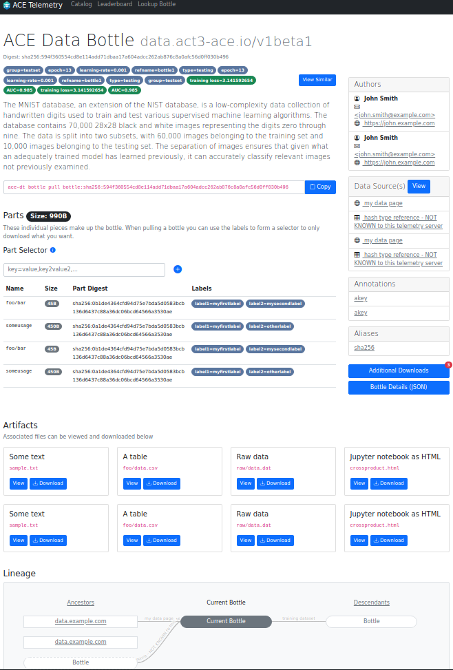

The Artifacts section shows public artifacts in the bottle and allows
conveniently downloading them as needed:

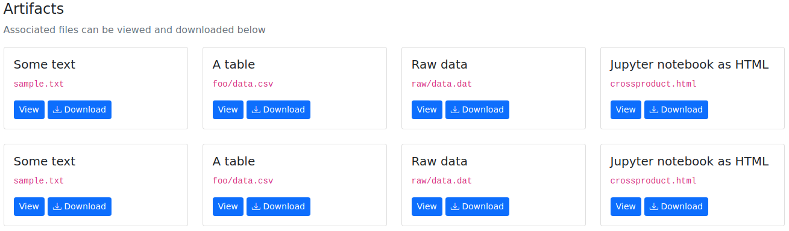

The Lineage section shows a bottle's ancestors and descendants, giving
users an understanding of other bottles to which the current bottle is
related:

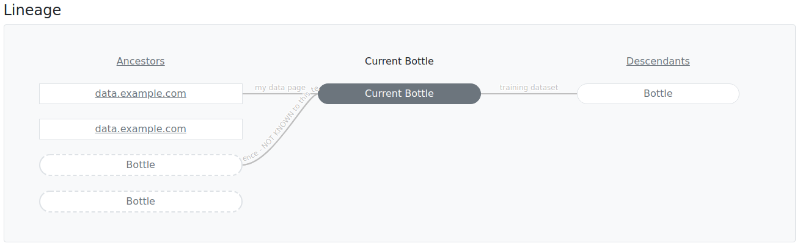

The Additional Downloads section shows users a list of registries from
which a bottle can be downloaded and includes a copyable ACE Data Tool
command to download the bottle:

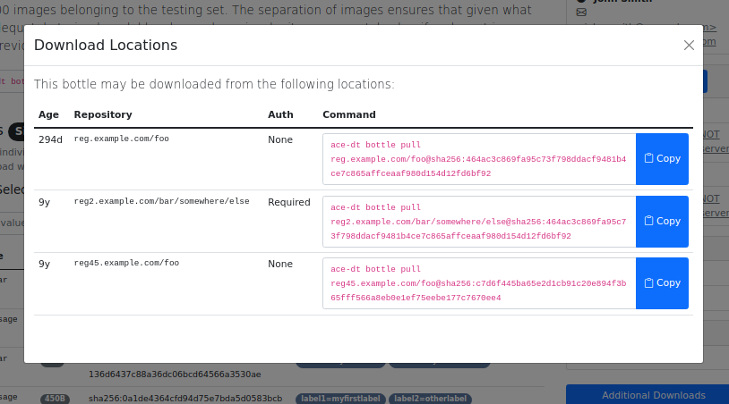

### Leaderboard

In autonomy and data science problems, researchers often want to find an
optimal machine learning model for a given task. They may train several
models, each with different parameters, and test them against a standard
test set. The resulting models will have varying levels of performance
for the task.

In larger research teams, individuals on the team may all work on the
same problem but without strong familiarity with the approaches of other
members of the team. To avoid duplication of work and to find good leads
for further research, a common picture that all members of the team can
view to know the "state of the art" for performance is required. This is
the purpose of the leaderboard functionality of the Telemetry Server.

The leaderboard shows, in ascending or descending order, all bottles
with a given metric and the value for the metric. This enables users to
run an experiment to train a model, "bottle up" the model, and set a
metric to let others know how the model performs for the task. A good
bottle also includes a description of how it was created, which gives
other researchers an understanding of how a well-performing bottle was
created and how they may take and improve upon it.

For example, example bottles with a "training loss" metric can be
searched:

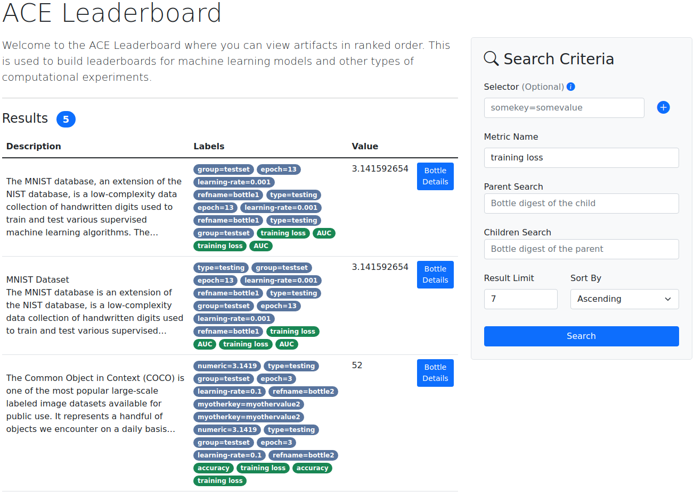

The metric name is arbitrary and can be decided on per-team and/or
per-project, giving maximum flexibility to researchers.

### Full-Text Search

While full-text search on a distributed, massive scale is difficult to
achieve without strong domain knowledge and dedicated engineering, it is
achievable with relative simplicity for a small team on a local scale.
The ACE Telemetry Server implements a primitive full-text search
capability via the facilities provided in the PostgreSQL database.

Basic full-text search involves summarizing and indexing certain columns
in a database table so that search queries can happen quickly when
needed. The summarization step includes *normalizing* the content of a
column (the "description" column, in the case of the Telemetry Server).

The normalization process involves throwing out common words such as "a"
or "for" and simplifying other words into their essence without any
plural or tense form. This simplified form of a word is known as a
*lexeme*, and it enables multiple forms of a word to be treated the same
way from a search platform's perspective. For instance, the word "lazy"
is distilled into the lexeme "lazi," which covers both the words "lazy"
and "laziness" for a search function.

When the column to be searched is turned into lexemes, the lexemes are
counted for frequency analysis. When a given word is searched, entries
with more instances of that word are generally ranked higher in the
search results.

The lexemes and frequency analysis are stored as a column of "tsvectors"
in the table, which is to be searched, and then an index is created from
the column which increases search speed. The index must be recomputed
frequently, and the frequency of reindexing is an engineering tradeoff
between computational power, database read overhead/bandwidth, and
desirability of up-to-date search results.

To set up the database for full-text search, the Telemetry Server
includes special functions in its database initialization code. When it
runs, it checks to see if the required tsvector column and search index
exist and if they do not, creates them.

An API method allows inputting a small (one or two words or a very
simple phrase) query and receiving a rank-ordered list of bottles whose
descriptions are related to the query. This is useful for researchers
searching for a particular kind of bottle, such as "aircraft."

A search for example bottles containing the term "coco" yields two
results:

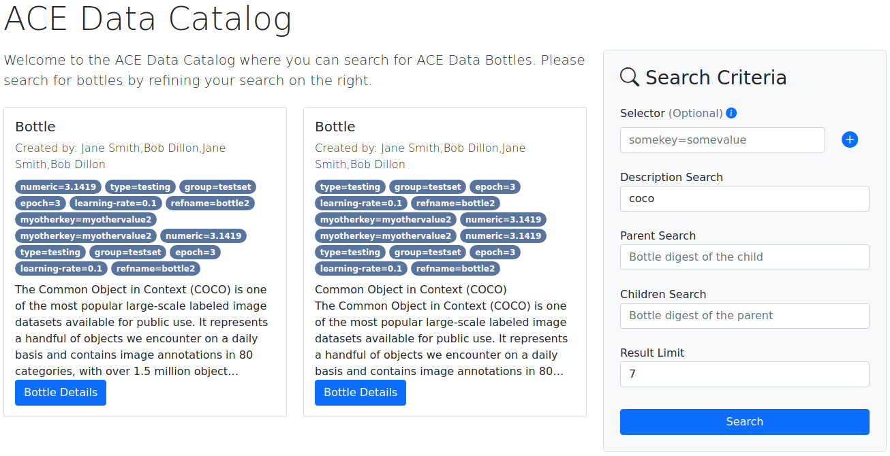

### Schema Versioning and Updates

Each data bottle includes metadata in a specific format. The fields are
well-defined, and users cannot arbitrarily add fields. However, as
development continues and users provide feedback, there are instances in
which a new field in the bottle schema is warranted. In these cases, it
is possible to add or modify fields in the schema and increment the
schema version.

This presents a problem for the Telemetry Server database. If its tables
are tailored for one version of data bottles, then it cannot understand
any other version; its tables do not have the fields which correspond to
other versions' data fields.

To solve this, bottles are processed when they are first presented to
the Telemetry Server. If the bottle indicates that its schema is the
latest version and passes validation checks, then it is treated normally
and entered directly into the database. If, on the other hand, the
bottle is an older version, the telemetry server includes functions to
transparently update the bottle's definition to the newest version so
that it can be stored rather than rejected.

Each version of the schema can be upgraded from the next older version,
enabling schemas which are several versions old to be incrementally
upgraded to the latest.

One side effect of upgrading bottle schemas is that the data in the
schema can change, thus modifying the digest value of the schema. This
technically means that the bottle is no longer "the same bottle," as its
contents have changed. To deal with this, the Telemetry Server preserves
the original (old version) schema as it was presented by the Data Tool.
There is functionality in the server's code to relate different versions
and different digests of the same data bottle together so that these
subtle server-side changes do not affect visibility or traceability of
bottles.

## Development and Packaging

The ACE Telemetry Server is developed and packaged similarly to other
ACE team and ACT3 projects. The project is hosted in the ACT3 Gitlab
instance at <https://gitlab.com/act3-ai/asce/data/telemetry>.

Issues are reported in the project, and development team members create
merge requests for improvements to be merged into the main code. When
code is pushed to the Gitlab server, automatic checks are conducted to
ensure the changes will not break existing functionality. Once a project
maintainer is satisfied that the requested changes are valid and safe,
they merge the new code in.

When a significant amount of code is merged (which is a subjective
assessment), a new version of the server is released and deployed to the
ACT3 infrastructure in the form of a Helm chart on a Kubernetes cluster.

### Test Data Generation and Coverage

The ACE Telemetry Server must handle a variety of use cases and inputs,
even those from potentially malicious actors. The API methods are
designed to validate all inputs and discard invalid ones, such as
mismatched hashes or references to nonexistent entries.

To test the functionality of the methods, robust test data is required.
The developers of the ACE Data Tool created a special tool which can
generate thousands of data bottles with realistic metadata pulled from
various internet sources. The data generation tool also enables linking
generated bottles together by specifying one bottle as a source to
another, which assists in testing the lineage functionality of the web
application.

Additionally, the Data Tool developers created a hand-crafted set of
data bottles to test the nuances of various ancestry situations, such as
the case where one bottle has two sources, one of which references the
other, and other unusual cases. This set of bottles helps developers of
the Telemetry Server to reason about the possibilities and handle edge
cases.

The Telemetry Server also includes functional tests for the API, using
Go's built-in test functionality. The overall test coverage at the time
of writing is around 50%, with a goal of reaching 80% as the project
reaches feature completeness. Tests are focused primarily on validating
input from users and ensuring that the database behaves consistently
with what the API requests are designed to do.

### Continuous Integration

Updates to the ACE Telemetry Server are enabled by a continuous
integration pipeline. The pipeline includes several steps to ensure the
quality of the program is preserved:

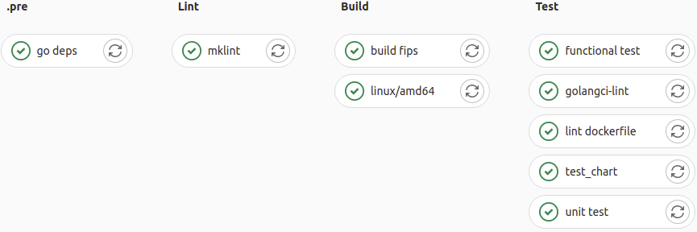

The first stage of the pipeline downloads external dependencies upon
which the server relies.

Next, a lint stage occurs to ensure the written quality of the code is
acceptable and follows conventions. If variables are capitalized
incorrectly, or if there is unnecessary whitespace or poorly formatted
comments, the lint stage will catch the error.

Following the lint, the binary code is built from source. The Telemetry
Server is built with Federal Information Processing Standard
(FIPS)-validated cryptography libraries for hashing files, and these
cryptography libraries are built in the first step. In the following
step, the server is built for the *linux/amd64* platform. If needed, new
steps could be added for other platforms and architectures, such as
*linux/arm64* (e.g., to run on a Raspberry Pi board) or Windows.

Once the server is built, the next stage tests the server to ensure it
functions correctly. This includes running low-level functional tests
with pre-determined test cases, such as uploading a bottle with a
certain hash and verifying that the upload was successful. The testing
stage also performs linting on the Dockerfile in preparation for
containerization.

#### Containerization

The ACE Telemetry Server is designed to run in a cloud-native,
container-driven environment. During the continuous integration process,
a few stages are executed to take the Telemetry Server binary and put it
into a container:

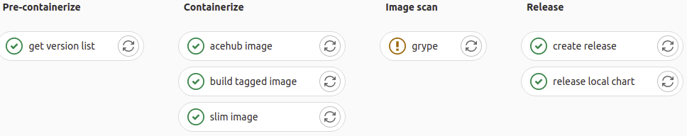

The pipeline is triggered when a developer adds a specific tag to a Git
commit on the server's code repository. The tag tells the pipeline to
build the container image with that tag and upload it to the
repository's container registry so that it can be used by other
entities, such as Kubernetes or a developer trying it out locally.

An "image scan" stage runs the Anchore Grype image scanner on the built
image to detect any vulnerable packages. This is a relatively new
technology and is subject to false positive and false negative results;
however, it allows developers to catch glaring security issues which
were previously obscured. *At the time of writing, this stage is not set
to cause the overall pipeline to fail when vulnerabilities are
discovered; it will only cause a warning*. This is a conscious decision
to favor development speed over security at the start of the project. As
the project matures and is used in more critical areas, security
vulnerabilities in libraries will be addressed more aggressively.

The final stage of the build pipeline involves two steps to release the
version. The first step creates a formal Gitlab release page with the
build artifact, enabling users to manually download the binary from a
convenient page. The second step builds a Helm chart from the *charts*
directory in the repository and pushes the chart to the repository's
container registry.

At the end of the build pipeline, three main products are created:

- ACE Telemetry Server binary
- Docker container image
- Helm chart

The binary is available from the Releases page, accessible from the main
repository page. The Docker container image is available from the
repository's registry at
<https://gitlab.com/act3-ai/asce/data/telemetry/container_registry>. The
Helm chart is also available from the repository's registry.

## Technologies/Terms of Reference

### Containers

While container technology has expanded explosively into an industry of
its own, the core concept is relatively straightforward. A container is
a process on a machine like any other, except that it is restricted in
the files that it can see and the actions that it can take. Containers
usually also receive their own network space allocation, which is
functionally no different from assigning an additional internet protocol
(IP) address to the host itself.

Containers are often compared with virtual machines (VM), sometimes with
the assertion that containers are like "lightweight VMs." While this is
somewhat true at a high level, the differences between the two
technologies are important to distinguish.

The primary distinction between VMs and containers is the inclusion of
an operating system (OS) kernel in VMs, while containers, being no more
than isolated processes, must use the kernel of its host. For this
reason, Windows VMs can run on Linux hosts and vice versa, but Windows
containers cannot run on Linux hosts, and Linux containers can only run
on Windows hosts through a transparent Linux VM.

Containers are "contained" by three primary mechanisms: chroot,
namespaces, and cgroups. Each mechanism protects the OS and other
processes from the container (and vice versa) in a different way, and
when combined, the container is considered "contained."

Chroot (pronounced "cha-root" or "change root") restricts the files that
a container can access, so that only a specific set of host folders are
available to the container. In practice, a container runtime creates a
folder somewhere on the host which is dedicated to the container. The
container can use this folder but has no visibility outside of the
folder; it believes that the folder is the root of the OS. Container
runtimes can also use bind-mounts to bring other folders into the
container's awareness.

Namespaces are a mechanism for isolating processes from one another. If
a container is only chroot'd, the container process (or sub-processes)
can still see and potentially interfere with other processes on the
host. With namespaces, processes, and other resources, such as network
interfaces, can be isolated from one another. A container is placed in
its own namespace so that it cannot see (and cannot be seen by) other
processes on the machine.

Cgroups enable limiting common resource usage, such as CPU and RAM. A
process can be placed into a cgroup to ensure that it cannot use more
CPU time or allocate more RAM than the cgroup allows. This ensures that
a memory leak or unusual peaks in usage of a particular service do not
impact other services on the host. Cgroups are hierarchical and can be
further subdivided, allowing the potential for resource-managed
containers inside containers.

### Go Programming Language

The Go programming language, often abbreviated as Golang, was developed
by Google in 2007 to address the coding challenges of a highly
networked, quickly changing compute environment.

Go is a statically typed, compiled language, making it highly portable
across a given platform (such as linux-x64). Natively compiled
languages, such a C and C++, typically require programmers to manage
memory allocation manually, which is an error prone process leading to
many bugs in production. Go, on the other hand, includes its own garbage
collector, freeing developers from needing to worry about deallocating
memory when it is no longer needed by the program. This makes it less
suitable than C, C++, or Rust for real-time applications where
microseconds matter, but in most cloud-native applications,
millisecond-level precision is typically fine.

Go also has implicit interface implementation, which means that if a
certain structure implements specifically named functions, and those
functions are defined to be part of an interface, the structure is
automatically considered to implement the interface. In other languages,
the structure must explicitly implement the interface, even if its
functions already match those of the interface's signature. This leads
to a certain "tribal knowledge" about common interfaces in Go, such as
the "Stringer" type, which implies that any structure with a "String()"
method can be displayed as a series of characters.

Additionally, Go is designed with concurrency as a core feature of the
language. Many languages were designed prior to the popularity of
multicore processors, and their concurrency features were added later as
additional libraries. Go's concurrency support comes in the form of
goroutines and channels, each of which are designed to simplify
message-queue and asynchronous designs. These features enable
programmers to design cloud-native programs which take advantage of as
many cores as presented to the program with less overhead, especially in
terms of memory utilization, than other languages.

### Data Hashes and Digests

A core feature of the ACE Telemetry Server is the fact that each data
bottle includes several layers of hashing to ensure the integrity of the
data. The layers are hashed, and the hashes in turn are fed into a hash
of the bottle's definition itself. This ensures that, if even a single
bit of the data changes, the users of the data will know about it, as
the bottle's signature will change.

Hashing is a technique of creating a sort of digital fingerprint of a
set of data. For a given hash function and a given set of data
(represented as a string of bytes), the data will always have the same
hash value. The hash value is a relatively short string of bytes which
is practically unique for that set of data. In fact, if two pieces of
data are found to have the same hash value, then the hash function is
considered broken and deprecated, and the security community moves to a
new, improved function.

For instance, the sentence:

    "This is a test sentence for use with the sha256sum utility."

has a SHA256 value of:

    3f37fbb87b3a03ddcb971f8e9ca81cde973f85d2c4429c99736f2e8f6ddb9a9d

If even a single letter of the sentence changes, even just an omission
of the punctuation at the end, then the entire hash changes. The same
sentence above, without the period:

    "This is a test sentence for use with the sha256sum utility"

now has a SHA256 value of:

    74104646d55a402bad86bc1fc924be8c9f0c4e3a39e263dcb979f5c02e26e0d8

This technology is at the heart of nearly every network connection in
some form or another, and it is used for numerous applications such as
password storage, caching, and, for ACT3, data bottle indexing and
identification.

There are many hash functions, and over time, some become deprecated due
to finding a "collision," or two sets of data which produce the same
hash value. In the past, a collision in a hash algorithm meant
monumental maintenance burdens for developer teams as they had to search
through all their code to replace the broken hash function with one
which is more secure.

In the Kubernetes ecosystem, it is assumed that a given hash function
will eventually be broken or otherwise fall out of favor. In addition,
some hash functions have certain desirable or undesirable properties,
such as slowness (which is sometimes seen as a positive feature, for
instance to slow down attackers attempting to discover a password from
its hash via brute force), and it is left up to the application
developer to decide which hash function to use. This is the purpose of
the digest, a light addition to the hash value.

A digest, in the Golang and Kubernetes communities, is just a hash value
which has its hash function appended to the front. In the example above,
the digest would simply be:

    sha256:3f37fbb87b3a03ddcb971f8e9ca81cde973f85d2c4429c99736f2e8f6ddb9a9d

This small addition, along with Go's built-in standard library support
for various digest formats, helps to simplify changes in hashing
algorithms when the decision is made to switch for security,
compatibility, compliance, or other business reasons.

One pitfall of switching hashing algorithms, however, is that a hash
from one algorithm cannot be directly converted to a hash of another
algorithm. The source material is required. This means that an
application must take one of the following approaches to hash migration:

- Continue supporting hashes from the old format, while new data uses the new format,
- Remove all hashes from the old format, often impractical except for applications with highly ephemeral data,
- Retain the source material and re-hash when a new algorithm is added, removing the old hashes afterward.

The ACE Telemetry Server takes the third approach because the source
material is not sensitive. However, in the case of storing something
like passwords, this would be an unacceptable approach, as the entire
point of storing the hash is to avoid having to store the password
itself.

### Relational Databases and Structured Query Language

A relational database is an abstraction which allows programmers and
database maintainers to think of data in terms of tables which relate to
one another. Each table has a set of columns with predefined types and
an arbitrary number of rows containing data. Each row has some unique
ID, often just a number which is automatically incremented, e.g., row 1,
2, 3, etc.

This unique ID can be referenced in other tables. For instance, in a
database which hosts a person's blog, there may be an "articles" table
and a "comments" table. When someone posts a comment on an article, a
new entry is made in the "comments" table, where one of the columns is
the ID of the article to which it is attached. In this case, the article
ID in the "comments" table is considered a foreign key---a reference to
another table.

This basic association can be used to relate many different data types
together across many tables. In the instance of articles and comments,
it would be said that the articles table has a "one to many"
relationship with the comments: a single article may have many comments,
but a comment can only belong to a single article.

More complex scenarios are also possible, though many modern designers
discourage them. Still, sometimes a "many to many" relationship is
needed. For instance, a person may have many duties, and a duty may have
many people who can do it.

There are many relational databases, ranging from highly proprietary
with heavy license fees and support contracts to lightweight and open
source. Each has its own features and drawbacks, but all relational
databases are accessed using some form of Structured Query Language
(SQL).

SQL has existed since the early 1970s, gaining standardization in the
mid '80s and continuing its evolution since then. SQL syntax is terse,
conversation-like, and command-oriented. SQL statements are centered
around getting, updating, or deleting data based on certain constraints.
For instance, the command:

    SELECT username FROM users WHERE passwordhash=\<some hash\>

is designed to take some password hash (passed in from an external
application, such as a web application's login screen), find the row in
the "users" table with that hash, and return the username.

Because writing SQL syntax manually is error-prone and leads to infamous
security flaws such as "SQL injection," many developers choose to use
well-written external libraries to handle creating the statements for
them. These libraries present a familiar interface to programmers, not
of terse SQL statements, but of structures or objects instead. The
developer defines some set of objects with certain fields (such as an
"author" with name and email fields), and the library handles creating
the SQL statements to create the necessary tables and interact with the
data in the database.

The library which serves this function is known as an object-relational
mapper (ORM). Most ORMs seek to minimize the amount of SQL the developer
must write, but they also leave raw methods available to the programmer
to handle special scenarios which the ORM was not designed to do.

## Acronyms

- ACE: Air/Space Force Cognitive Engine
- ACT3: Autonomous Capabilities Team 3
- AFRL: Air Force Research Laboratory
- API: application programmer interface
- BSD: Berkeley Software Distribution
- CPU: central processing unit
- CQL: cipher query language
- FIPS: Federal Information Processing Standard
- HTTP: hypertext transfer protocol
- IP: internet protocol
- JSON: JavaScript object notation
- MIT: Massachusetts Institute of Technology
- OCI: open container initiative
- ORM: object relational mapper
- OS: operating system
- SHA256: Secure Hash Algorithm, 256-bit
- SQL: structured query language
- URI: universal resource identifier
- URL: universal resource locator
- VM: virtual machine
- VPN: virtual private network
- YAML: yet another markup language
- YAML - YAML Ain't Markup Language (a recursive acronym)
